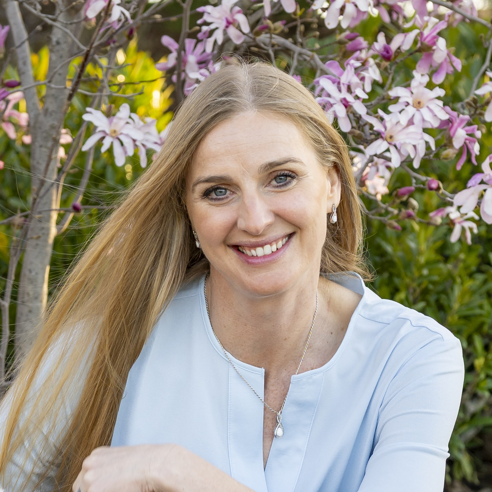

:::: {.grid .align-items-center}

::: {.g-col-12 .g-col-md-7}
## Lorraine Gaudio

Hello World!

After 20-plus years of grooming dogs, I did a 180 and went back to school. I earned a master’s degree in anthropology and am now pursuing a PhD in computing with a focus on knowledge networks, responsible AI, and interdisciplinary collaboration. I am also a RISE Fellow studying how emerging technologies shape research, learning, and human flourishing.
:::

::: {.g-col-12 .g-col-md-5}
{width="70%" .img-fluid .d-block .mx-auto}
:::

::::

:::: {.row .align-items-center .g-4}

::::

::: {.network-banner}
:::

## What I study

I study how knowledge, values, and emerging AI practices move through research and learning communities. My work brings together data analytics, social network analysis, mixed methods, and human-centered approaches to emerging technology.

## What I do

::: {.feature-grid}
::: {.feature-card}
### Map knowledge networks

I use network thinking to study collaboration, technology adoption, and the movement of practices across communities.
:::

::: {.feature-card}
### Study AI in practice

I examine how people learn, teach, collaborate, and make decisions with generative AI and other emerging technologies.
:::

::: {.feature-card}
### Build bridges across fields

I work across computing, anthropology, education, and responsible innovation to support more thoughtful technology use.
:::
:::

## Research nodes

::: {.node-grid}
::: {.node-card .node-one}
### Knowledge Networks & Responsible AI

My current research direction focuses on how knowledge, values, and AI practices move through research and learning communities.

[Explore direction](research.qmd#current-direction)
:::

::: {.node-card .node-two}
### Social Impacts of Emerging Technologies

RISE and SioC connect my work to broader questions about emerging technologies, well-being, and interdisciplinary collaboration.

[View work](rise.qmd)
:::

::: {.node-card .node-three}
### Human-Centered AI Communities

I contribute to projects that examine how AI is shaping practice in education, healthcare, and community settings.

[View collaboration](research.qmd#i2hcai)
:::

::: {.node-card .node-four}
### Teaching, Learning, and AI

My teaching work explores AI-era learning, R programming, student agency, and responsible tool use.

[View teaching](teaching.qmd#data-r155)
:::

::: {.node-card .node-five}
### Network Analysis & Collaboration

My master’s thesis used social network analysis to study interdisciplinary collaboration at Boise State.

[View foundation](research.qmd#masters-thesis)
:::
:::