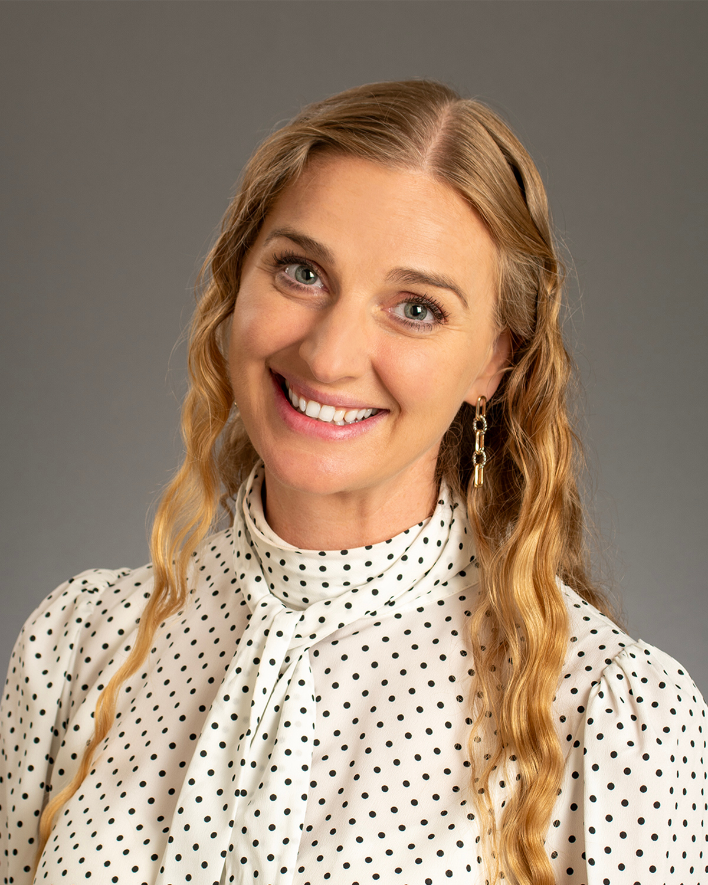

::: {.home-hero}

:::: {.grid .align-items-center .home-hero-inner}

::: {.g-col-12 .g-col-md-7 .hero-copy}

::: {.hero-eyebrow}
PhD student in Computing at Boise State University · RISE Fellow
:::

# Lorraine Gaudio

::: {.hero-lead}
I study how AI is reshaping knowledge creation and collective learning in research and education communities.
:::

My research examines how people trust, verify, adapt, reject, and share AI-mediated practices, and how those patterns affect collective intelligence, scientific integrity, and human judgment.

::: {.hero-actions}
[Explore my research](research.qmd){.btn .btn-primary}
[View collaborations](human-centered-ai-collaborations.qmd){.btn .btn-secondary}
[CV & selected work](cv.qmd){.btn .btn-secondary}
:::

:::

::: {.g-col-12 .g-col-md-5 .hero-photo}

{fig-alt="Professional portrait of Lorraine Gaudio" .img-fluid}

:::

::::

:::

::: {.home-section}

## Current research focus

AI systems are becoming part of how researchers generate ideas, evaluate evidence, make decisions, and learn from one another. I study these changes as features of a larger sociotechnical system involving people, AI tools, institutions, networks, practices, and norms.

Across this work, I ask how AI-mediated practices spread through communities, how people decide when to rely on or question AI, and how repeated interactions may shape collaboration, diversity of knowledge, and scientific self-correction.

Methodologically, I draw on social network analysis, data analytics, and mixed methods. I am also developing computational and agent-based modeling approaches to study human-AI systems over time.

::: {.topic-tags}
[Social network analysis]{.topic-tag}
[Human-AI systems]{.topic-tag}
[Data analytics]{.topic-tag}
[Collective intelligence]{.topic-tag}
[Scientific integrity]{.topic-tag}
[Computational modeling]{.topic-tag}
:::

:::

::: {.home-section}

## Explore my work

::: {.node-grid}

::: {.node-card .node-one}
### Current PhD research

I examine how AI-mediated practices move through research communities and how trust, verification, and social learning shape their adoption.

[Explore my research](research.qmd)
:::

::: {.node-card .node-two}
### RISE Fellowship

As a RISE Fellow, I study the societal impacts of emerging technologies through interdisciplinary and stakeholder-engaged research.

[Learn about RISE](rise.qmd)
:::

::: {.node-card .node-three}
### Human-Centered AI Collaborations

I contribute to interdisciplinary projects examining how AI is changing research, education, and professional practice.

[View collaborations](human-centered-ai-collaborations.qmd)
:::

::: {.node-card .node-four}
### Teaching and Learning

I teach Introduction to R Programming and design learning environments centered on coding, AI use, student agency, and reproducible practice.

[Explore my teaching](teaching.qmd)
:::

::: {.node-card .node-five}
### Social Network Analysis

My master's research used social network analysis to examine interdisciplinary collaboration and the structure of research relationships.

[Read about my master's research](research.qmd#masters-thesis)
:::

:::

:::

::: {.home-section .selected-work}

## Selected scholarship

**Gaudio, E. L. (2024).** *The dawn of advanced collaborative practices: Charting transdisciplinary synergies through thematic and social network analysis within Boise State's Grand Challenges initiative.* Boise State University Theses and Dissertations.  
[Read my master's thesis](https://doi.org/10.18122/td.2143.boisestate){target="_blank"}

**Gaudio, L., Larson, A., Dunn, L., & McClure, C. J. W. (2023).** Temperature changes are associated with the breeding phenology of Mountain Bluebirds (*Sialia currucoides*) in southern Idaho. *The Wilson Journal of Ornithology.*  
[View the publication](https://doi.org/10.1676/22-00112){target="_blank"}

[See more selected work](cv.qmd)

:::
